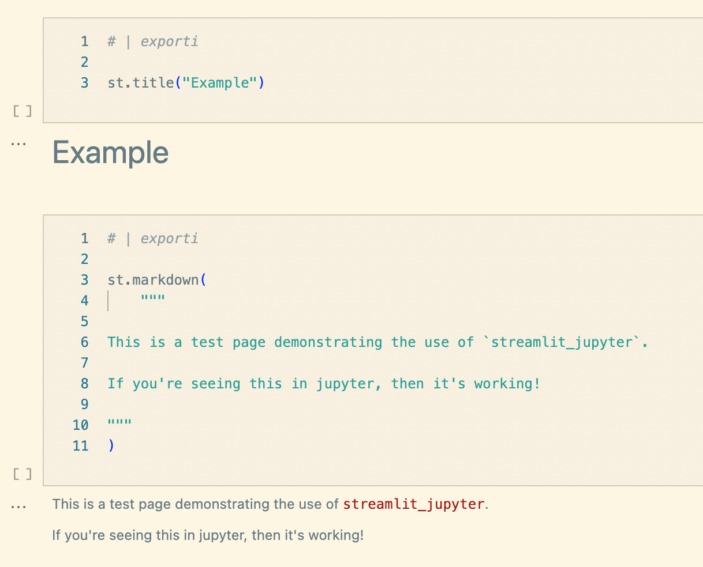
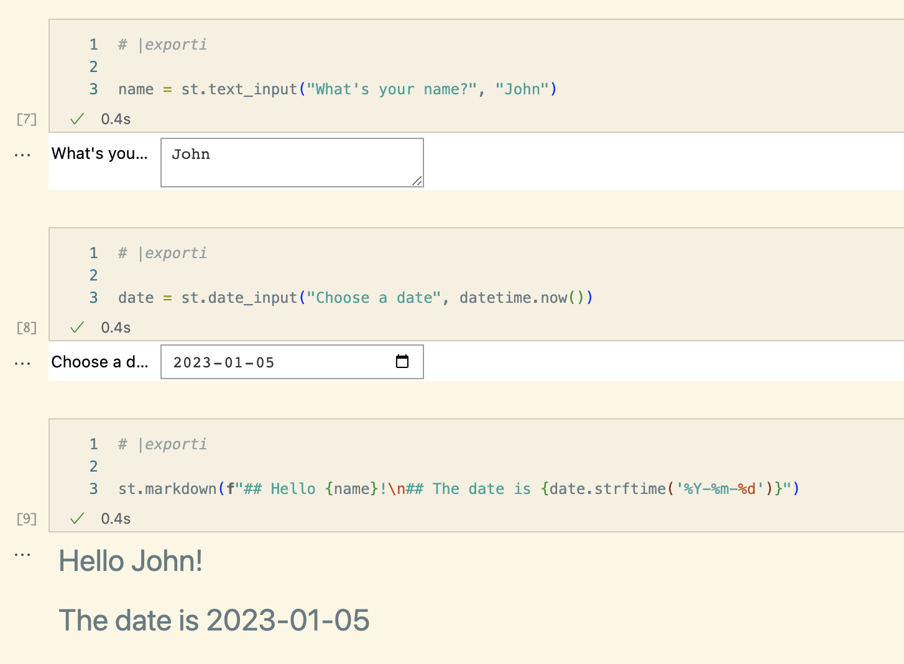
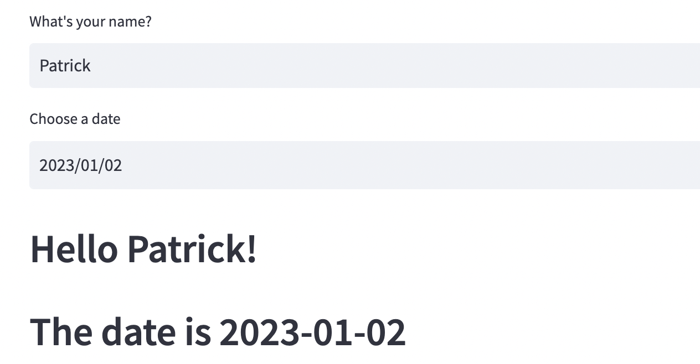
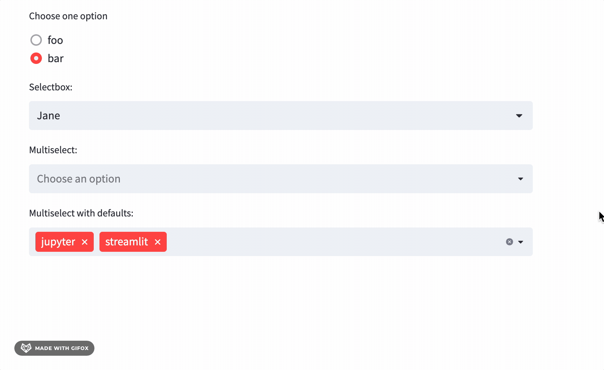
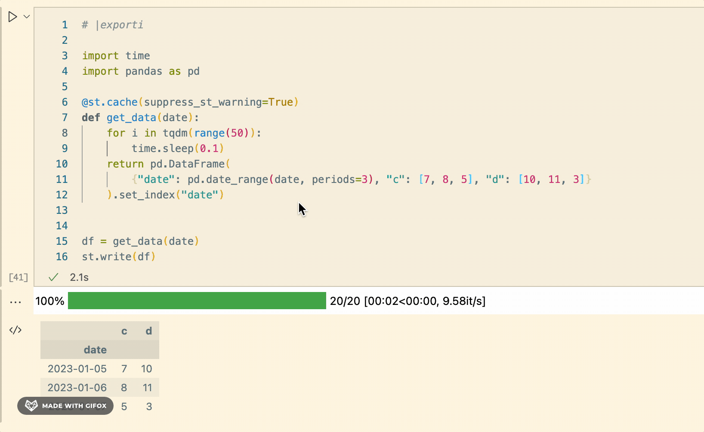
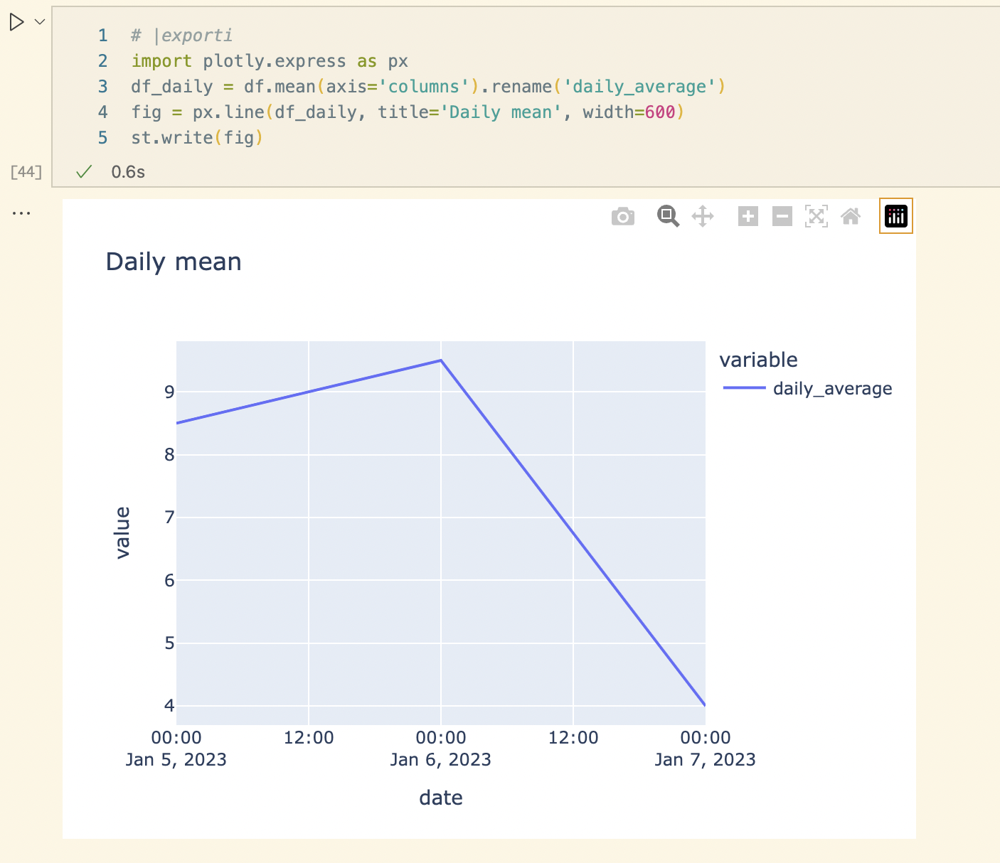
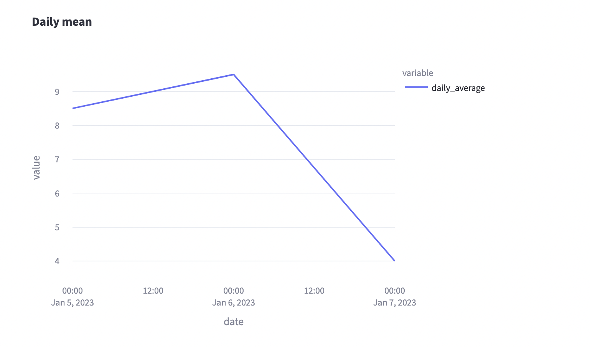

streamlit-jupyter
================

<!-- WARNING: THIS FILE WAS AUTOGENERATED! DO NOT EDIT! -->

## Docs & links

- Detailed docs for this library can be found at
  [ddobrinskiy.github.io/streamlit-jupyter](https://ddobrinskiy.github.io/streamlit-jupyter)

- ToDos on [github
  project](https://github.com/users/ddobrinskiy/projects/4/views/1)

- The rest of this README provides a quick overview of the library.

## Install

``` sh
pip install streamlit_jupyter
```

## How to use

Take a look at our [example notebook](./examples/99_example.ipynb)

The main idea is for you do experiment and develop in your notebook,
visually see all the pieces, and then convert the notebook to `.py` to
be run by streamlit

start by importing streamlit and patching it with streamlit-jupyter:

``` python
import streamlit as st

from streamlit_jupyter import StreamlitPatcher, tqdm

StreamlitPatcher().jupyter()  # register streamlit with jupyter-compatible wrappers
```

And now develop your notebook as usual, but with the ability to use
Streamlit widgets and components.

See how it works below, and check out the [example
notebook](./examples/99_example.ipynb)

## Demonstration

|                                       |  Jupyter |  Streamlit |
|:-------------------------------------:|:-------------------------------------------------------------:|:------------------------------------------------------------------:|
|         Markdown and headings         |                                |                                   |
|        Interactive data entry         |                                |                                   |
|            Pick and choose            |                                |                                   |
| Dataframes, caching and progress bars |                                |                                   |
|                 Plots                 |                                |                                   |
