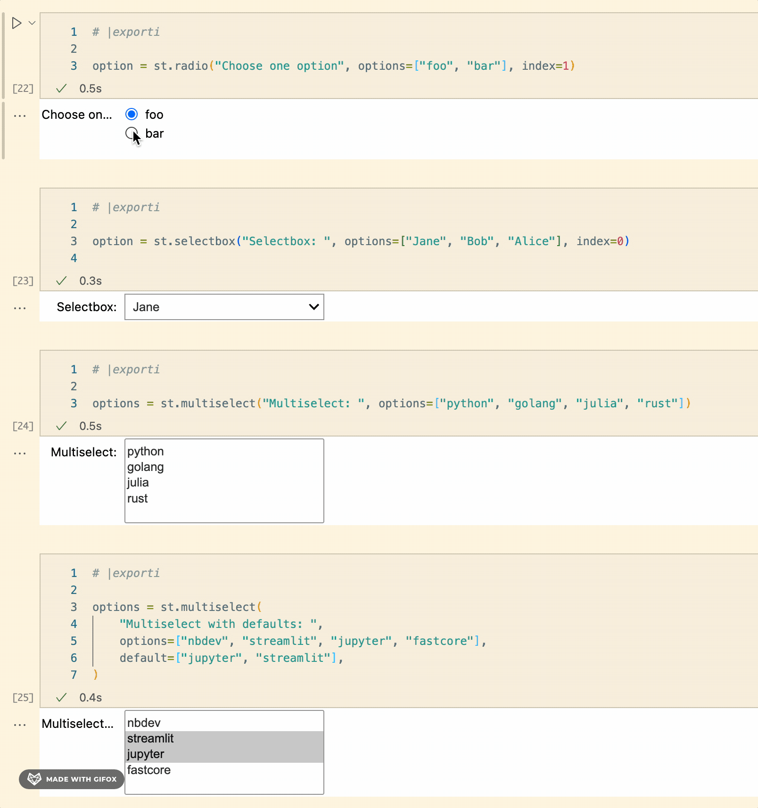

streamlit-jupyter
================

<!-- WARNING: THIS FILE WAS AUTOGENERATED! DO NOT EDIT! -->


[](https://github.com/ddobrinskiy/streamlit-jupyter/actions)

## Docs & links

- Detailed docs for this library can be found at
  [ddobrinskiy.github.io/streamlit-jupyter](https://ddobrinskiy.github.io/streamlit-jupyter)

- ToDos on [github
  project](https://github.com/users/ddobrinskiy/projects/4/views/1)

- The rest of this README provides a quick overview of the library.

## Install

``` sh
pip install streamlit_jupyter
```

## How to use

Take a look at our [example notebook](./examples/99_example.ipynb)

The main idea is for you do experiment and develop in your notebook,
visually see all the pieces, and then convert the notebook to `.py` to
be run by streamlit

start by importing streamlit and patching it with streamlit-jupyter:

``` python
import streamlit as st

from streamlit_jupyter import StreamlitPatcher, tqdm

StreamlitPatcher().jupyter()  # register streamlit with jupyter-compatible wrappers
```

And now develop your notebook as usual, but with the ability to use
Streamlit widgets and components.

See how it works below, and check out the [example
notebook](./examples/99_example.ipynb)

## Currently supported methods

Refer to excellent [streamlit
docs](https://docs.streamlit.io/library/api-reference) for more details
on each method

| method           | docstring                                                                                |
|:-----------------|:-----------------------------------------------------------------------------------------|
| `st.cache`       | Function decorator to memoize function executions.                                       |
| `st.caption`     | Display text in small font.                                                              |
| `st.checkbox`    | Display a checkbox widget.                                                               |
| `st.code`        | Display a code block with optional syntax highlighting.                                  |
| `st.dataframe`   | Display a dataframe as an interactive table.                                             |
| `st.date_input`  | Display a date input widget.                                                             |
| `st.expander`    | Insert a multi-element container that can be expanded/collapsed.                         |
| `st.header`      | Display text in header formatting.                                                       |
| `st.json`        | Display object or string as a pretty-printed JSON string.                                |
| `st.latex`       | Display mathematical expressions formatted as LaTeX.                                     |
| `st.markdown`    | Display string formatted as Markdown.                                                    |
| `st.metric`      | Display a metric in big bold font, with an optional indicator of how the metric changed. |
| `st.multiselect` | Display a multiselect widget.                                                            |
| `st.radio`       | Display a radio button widget.                                                           |
| `st.selectbox`   | Display a select widget.                                                                 |
| `st.subheader`   | Display text in subheader formatting.                                                    |
| `st.text_area`   | Display a multi-line text input widget.                                                  |
| `st.text_input`  | Display a single-line text input widget.                                                 |
| `st.text`        | Write fixed-width and preformatted text.                                                 |
| `st.title`       | Display text in title formatting.                                                        |
| `st.write`       | Write arguments to the app.                                                              |

## Currently **un**supported methods

Most of the other methods are not supported yet.

If you need any of them, you have one of 2 options:

- please open an issue or a PR

- use them in your notebook regardless, they will still work once you
  convert your notebook to streamlit. You just won’t be able to preview
  them in jupyter.

## Demonstration

|                                       |  Jupyter |  Streamlit |
|:-------------------------------------:|:-------------------------------------------------------------:|:------------------------------------------------------------------:|
|         Markdown and headings         |                                |                                   |
|        Interactive data entry         |                                |                                   |
|            Pick and choose            |                                |                                   |
| Dataframes, caching and progress bars |                                |                                   |
|                 Plots                 |                                |                                   |
|                Metrics                |                                |                                   |
